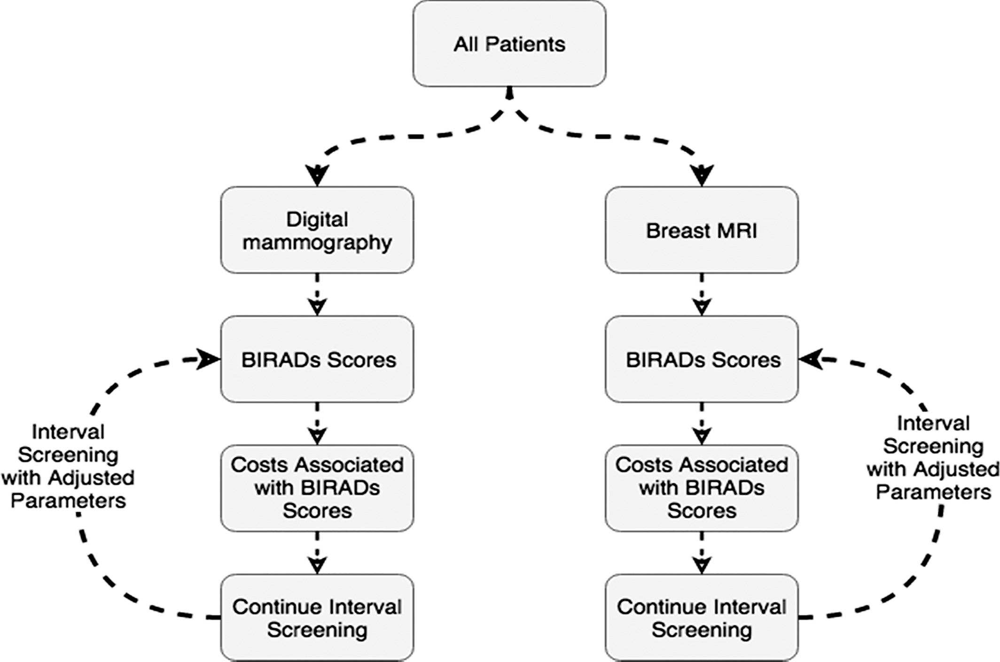

# Monte Carlo Simulations for Breast CA Mammography Screening

This code was used to generate the results for our published article.

Mango, V. L., Goel, A., Mema, E., Kwak, E., & Ha, R. (2019). Breast MRI screening for average‐risk women: A monte carlo simulation cost–benefit analysis. Journal of Magnetic Resonance Imaging, 49(7), e216-e221.

### Schematic of Simulation Steps

